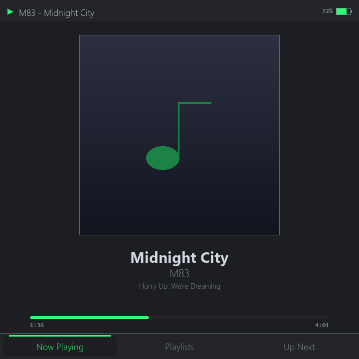
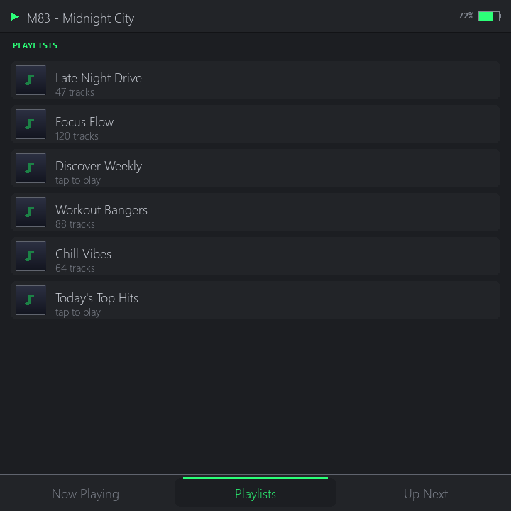
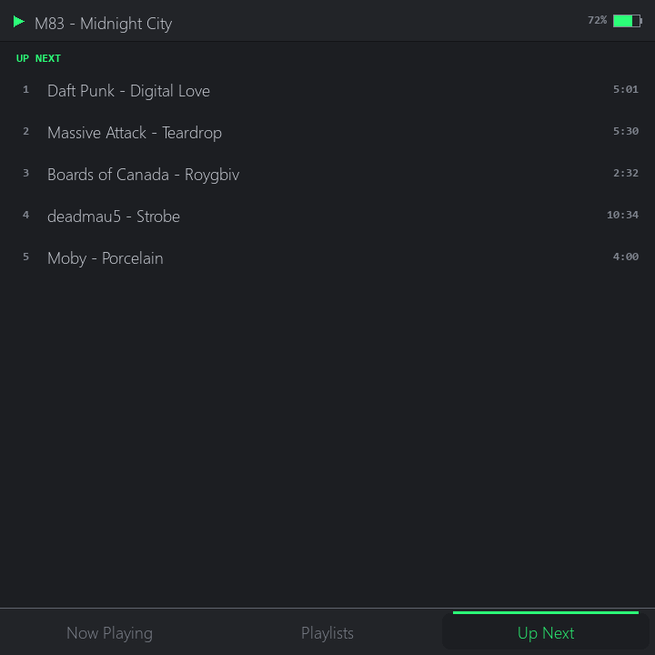
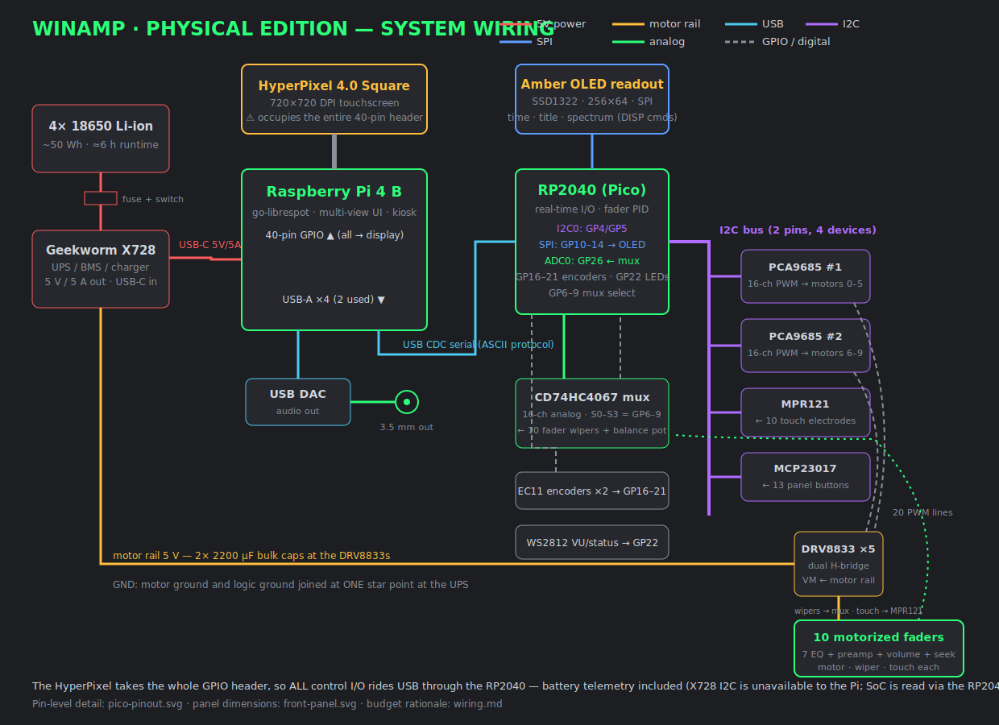
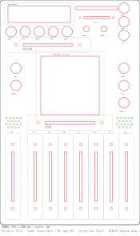
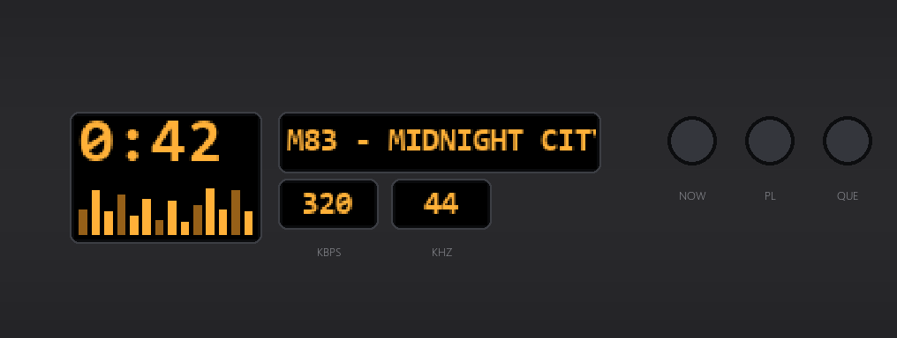

# SpotAmp 🎛️

**A standalone desktop Spotify player with real motorized faders, physical
buttons, and a WinAmp-inspired soul.** Raspberry Pi + RP2040, open hardware and
software (MIT). It sits on your desk on a pop-out stand, plays Spotify with **no
phone and no cloud remote** — and when you load an EQ preset, the faders
physically glide into place.

[](https://github.com/Paco5687/SpotAmp/actions/workflows/ci.yml)

> *It really whips the llama's ass.* (Inspired by [Eslam Mohamed's WinAmp
> hardware concept](https://www.yankodesign.com/2024/04/27/modular-media-player-concept-brings-iconic-winamp-design-to-the-physical-world/) — but real, and it plays.)

## The screen (running today on the device)

The center of the unit is a square 720×720 touchscreen (HyperPixel 4.0) running
a compact multi-view UI — switched by dedicated physical buttons:

| Now Playing | Playlists | Up Next |
|---|---|---|
|  |  |  |

This already runs **standalone on the Pi**: boots straight into the UI (kiosk),
streams via go-librespot, browses your real library, plays through its own
speakers-to-be. Transport, EQ, volume, and seek live in *hardware* — including a
**seek fader that physically tracks the song**.

## The hardware design

| System wiring | RP2040 pinout |
|---|---|
|  |  |

**Front panel** — dimensioned, parametric, CAD-ready
([DXF for SketchUp / SVG for Blender](hardware/cad/)):



Envelope **127 × 255 × 30 mm** (5″ × 10″), FDM prototype → CNC **anodized
aluminum** final, with aluminum knobs and a fold-out kickstand. The display
cluster is one 256×64 amber OLED behind **four sculpted apertures** —
registered to the display's real active area, simulated before cutting:



## How it works

```
        ┌───────────────────────────┐        USB serial        ┌──────────────────────┐
        │     Raspberry Pi 4 B       │◀───────(ASCII)──────────▶│  RP2040 (Pico)       │
        │                            │                          │                      │
        │  go-librespot ─▶ ALSA EQ ─▶│─▶ USB DAC ─▶ amp/spkrs   │  buttons · encoders  │
        │        │            ▲      │                          │  amber OLED readout  │
        │  Spotify Web API    │      │   FADER <id> <pos> ──────▶  10 motorized faders │
        │        │            │      │                          │   (PID position loop)│
        │  multi-view UI ─────┘      │◀──── EV BTN/FADER/BAT ───│  battery · touch     │
        └───────────────────────────┘                          └──────────────────────┘
             720×720 touchscreen                                 I2C: PCA9685×2 · MPR121
                                                                      MCP23017 · TPA2016
```

Two brains: the Pi runs Spotify + the screen; the RP2040 owns real-time I/O and
the fader PID loops. Full detail: [docs/architecture.md](docs/architecture.md) ·
[serial protocol](docs/serial-protocol.md) · [wiring + pin maps](hardware/wiring.md).

## Status

**Working now** — standalone playback on the device (no phone), kiosk boot,
touch UI (now playing / playlists / queue), real album art, Spotify Connect
control path, complete RP2040 firmware (compiled, awaiting parts), dimensioned
panel drawing, full parts list.

**Next** — order parts → single-fader PID bring-up → OLED + buttons → motorized
EQ → speakers/amp → battery → enclosure. Live plan on the
**[project board](https://github.com/users/Paco5687/projects/4)**.

## Build one

| | |
|---|---|
| 🛒 [Parts list](hardware/PARTS.md) | real SKUs, ~$450–515 + Pi/screen |
| 📄 [BOM + rationale](hardware/BOM.md) | why every part is there |
| 🔌 [Wiring & schematics](hardware/wiring.md) | address maps, pin budget, diagrams |
| 📐 [Panel CAD](hardware/cad/) | parametric DXF/SVG generator |
| 🧲 [Enclosure notes](hardware/enclosure.md) | machining rules, kickstand, findings |
| 🥧 [Pi bring-up](docs/pi-bringup.md) | reproducible standalone-player setup |
| 🎹 [Firmware](firmware/) | RP2040, PlatformIO, bench bring-up guide |

Try the UI on any machine (no hardware, no account):

```bash
cd pi && pip install -r requirements.txt && python -m spotamp
```

## The honest hard parts

- **Spotify Premium required** — playback uses [go-librespot](https://github.com/devgianlu/go-librespot)
  (unofficial). Browsing uses the Web API in Dev Mode (see
  [docs/spotify-setup.md](docs/spotify-setup.md) for the one-time standalone auth).
- **Motorized faders are the cost/complexity center** (~$200+ of the build) —
  and the reason this thing will be cool.
- The HyperPixel takes **all 40 GPIO**, so everything else rides USB + an I2C
  expander architecture — see [hardware/wiring.md](hardware/wiring.md).

## Naming & trademarks

SpotAmp is an independent, unofficial hobby project. It is **not affiliated with,
endorsed by, or sponsored by Spotify** (you bring your own Premium account and
developer app), and it is not associated with WinAmp/Llama Group — the UI is an
original homage to the classic WinAmp aesthetic, with no assets from it.

*(Formerly "WinAmpPlayer" — old links redirect.)*

## License

[MIT](LICENSE) — build one, remix it, tell us how it goes.
